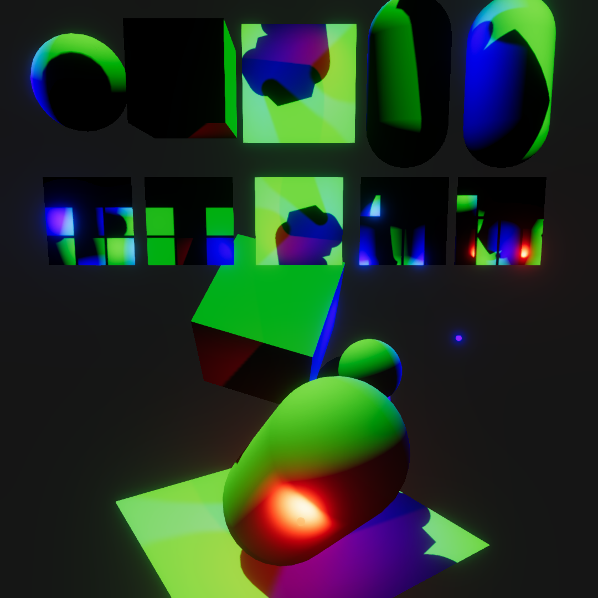
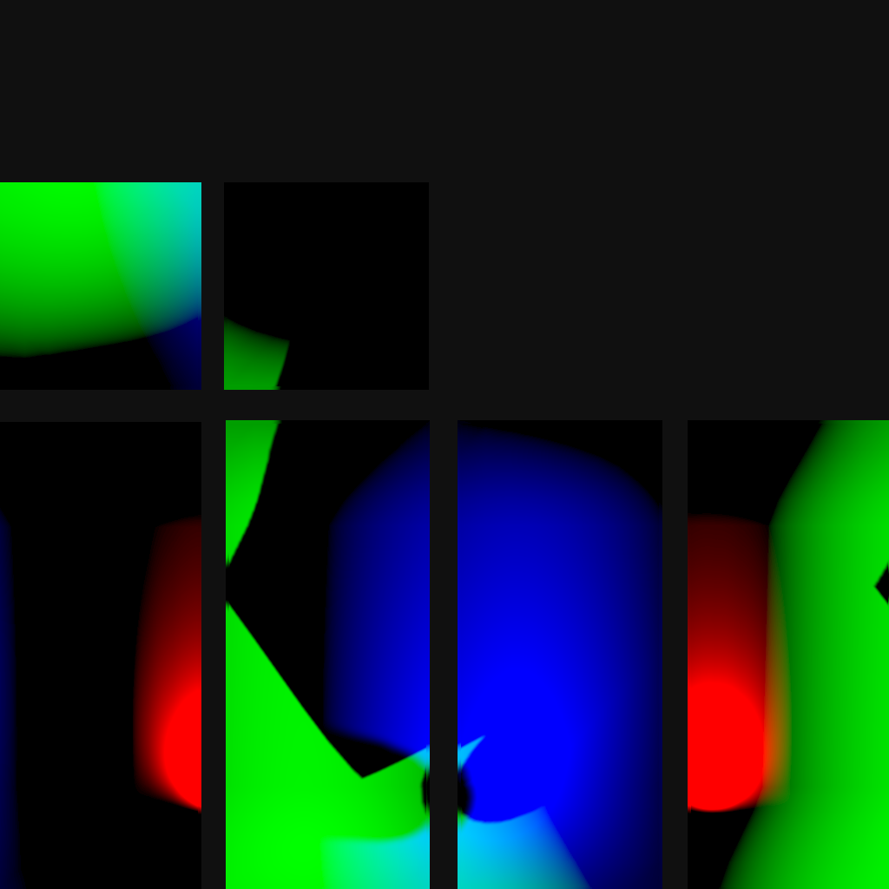

# Unity Runtime Lightmap Baker

A system to bake dynamic lights and shadows into lightmaps at runtime within Unity's Universal Render Pipeline (URP).

This tool is designed for scenarios where lighting conditions can change dynamically, but the scene geometry remains static, allowing for high-quality baked lighting without the performance cost of fully dynamic lights.

## Screenshots


| Lighting Scene | Baked Lightmap Texture |
|:-:|:-:|
|  | |


## Core Logic

The system is composed of two main scripts that work together to perform the baking process.

### `RuntimeLightmapBaker.cs` (The Conductor)

This is the main `MonoBehaviour` component that you add to your scene. It orchestrates the entire baking process.

-   **Target Management:** It holds a list of `Renderer` components that you want to bake lighting for.
-   **Resource Management:** For each target renderer, it creates and manages a dedicated `RenderTexture` which will become its lightmap.
-   **Baking Isolation:** It uses a clever trick with `RenderingLayerMask` to isolate each target object. Before baking, it assigns a unique rendering layer to a target renderer and configures the scene's lights to only affect that layer. This ensures that only one object is drawn into its lightmap at a time.
-   **Command Queueing:** It prepares all the necessary information for each target (the renderer, its lightmap texture, and its unique layer mask) and enqueues this data into the `RealTimeLightBakerFeature` for processing within the URP render loop.
-   **Material Texture Passthrough:** Before each bake pass, it inspects the target renderer’s material for `_BaseMap`, `_BumpMap`, and `_SpecGlossMap`. When found, those textures (and their tiling/offset values) are pushed to the baking pipeline so the bake material renders with the same surface inputs the target uses at runtime.
-   **Finalization:** After the feature has finished baking, this script handles applying the newly baked lightmap texture to the target's material properties.

### `RealTimeLightBakerFeature.cs` (The Worker)

This is a `ScriptableRendererFeature` that integrates the baking process directly into URP's rendering pipeline.

-   **Pipeline Injection:** It adds a custom `ScriptableRenderPass` (`BakePass`) to the pipeline at a specified event (e.g., after shadows are rendered).
-   **Bake Execution:** The `BakePass` receives the list of targets from the `RuntimeLightmapBaker`. For each target, it performs the following steps using the Render Graph API:
    1.  It sets the render target to the appropriate `RenderTexture`.
    2.  It creates a `RendererList` that contains only the single object to be baked, filtered by the unique `RenderingLayerMask` provided by the "Conductor".
    3.  It draws the object using a special override material (`UVRuntimeBakerURP.shader`).
-   **Cleanup:** After all targets are baked, it calls back to the `RuntimeLightmapBaker` to restore all the temporary changes made to renderers and lights.

## Shaders

The baking process relies on a few key shaders.

### `UVRuntimeBakerURP.shader` (The Baker)

This is the core shader responsible for the baking itself. It doesn't render the object to the screen, but rather "unwraps" it into a 2D texture.

-   **Vertex Shader:** The key operation happens here. Instead of transforming the mesh vertices into camera clip space, it uses the object's lightmap UV coordinates (`TEXCOORD1` or uv2) to lay the mesh flat in clip space. The result is that the object's surface is drawn across the render texture, guided by its UV layout.
-   **Fragment Shader:** For each pixel on this unwrapped surface, the fragment shader calculates the full URP lighting, including contributions from the main light, additional lights, and their shadows. The final computed light and shadow color is written to the render texture, which effectively becomes the object's lightmap.
-   **Supplied Global Textures:** At bake time the pipeline sets the following global textures (and accompanying scale/offset vectors) so the shader can faithfully reproduce the target material:
    - `_RTLB_BaseMap` / `_RTLB_BaseMap_ST` – main surface texture.
    - `_RTLB_BumpMap` / `_RTLB_BumpMap_ST` – normal map (falls back to `Texture2D.normalTexture` when absent).
    - `_RTLB_SpecGlossMap` / `_RTLB_SpecGlossMap_ST` – specular/smoothness map (falls back to black).
    Custom bake shaders should declare matching `TEXTURE2D`/`SAMPLER` pairs and sample them using uv0 transformed by the provided ST values.

### `UVDilation.shader` (The Finisher)

This is an optional but highly recommended post-processing shader that runs after the main bake pass.

-   **Purpose:** It prevents visual artifacts like black seams that can appear at the edges of UV islands in the lightmap.
-   **Process:** It performs a dilation or "bleed" operation. For each empty pixel (a pixel not covered by the object's UVs), it looks at its neighbors. If it finds a neighbor with baked lighting, it copies that color, effectively bleeding the color outward by a few pixels. This ensures that texture filtering near UV edges has valid data to sample from.

### `ShadowOnly.shader` (The Catcher)

This is a utility shader not directly used in the lightmap baking process itself, but useful in combination with it.

-   **Function:** It's a transparent shader that doesn't render any color or texture, but only receives shadows. It calculates the amount of shadow falling on it and outputs that as a transparent, tinted color.
-   **Use Case:** This is perfect for creating "shadow catcher" planes. You can have a fully baked scene, but place a transparent plane on the ground to receive dynamic shadows from a moving character, blending the dynamic and baked worlds seamlessly.

## How to Use

1.  **Add the Feature:** In your project's URP settings, select your `UniversalRendererData` asset and add the `RealTimeLightBakerFeature` to the list of "Renderer Features".
2.  **Assign Materials:** Assign the `UVRuntimeBakerURP.shader` to the `Bake Material` field in the feature's settings. If you want to use dilation, enable it and assign the `UVDilation.shader` to the `Dilation Material` field.
3.  **Add the Component:** Add the `RuntimeLightmapBaker` component to a GameObject in your scene.
4.  **Set Targets:** Assign the `Renderer` components of the objects you want to bake to the "Targets" list on the `RuntimeLightmapBaker`.
5.  **Check UVs:** Ensure that all target objects have a valid second UV channel (UV2) properly unwrapped for lightmapping.
6.  **Configure:** Adjust settings like `Bake Every Frame` and `Lightmap Size` as needed.
7.  **Update Material Shader:** The baked lightmap is sent to the material via a texture property (default: `_RuntimeLightmap`). Your object's material shader must be modified to read this texture and apply it. For example, you could multiply the final albedo color by the lightmap color.

```hlsl
// Example of sampling the runtime lightmap in your shader
half4 runtimeLightmap = SAMPLE_TEXTURE2D(_RuntimeLightmap, sampler_RuntimeLightmap, i.uv2);
finalColor.rgb *= runtimeLightmap.rgb;
```

> **Authoring custom bake shaders:** If you author an alternative to `UVRuntimeBakerURP.shader`, declare `TEXTURE2D`/`SAMPLER` pairs for `_RTLB_BaseMap`, `_RTLB_BumpMap`, `_RTLB_SpecGlossMap` and read them with UV0 transformed by the associated `_RTLB_*_ST` vectors. These globals mirror the textures assigned to each target renderer at bake time, guaranteeing the bake material receives the same surface inputs users see in-game.
